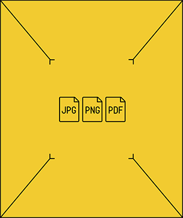
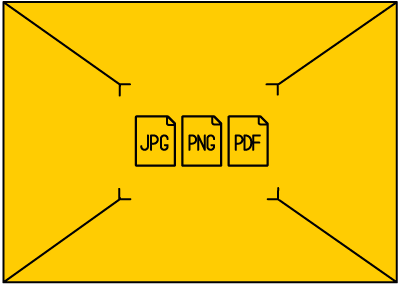
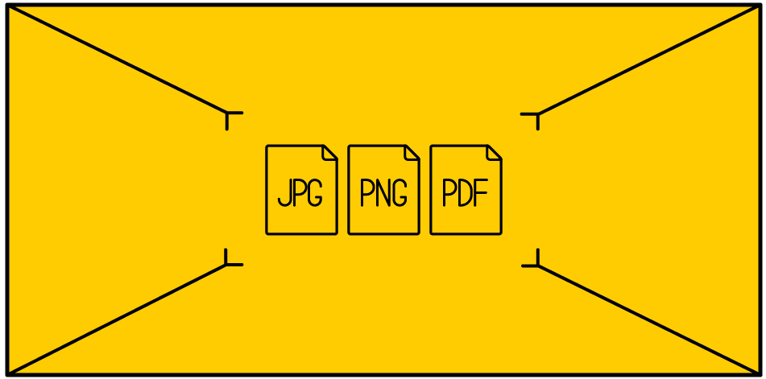
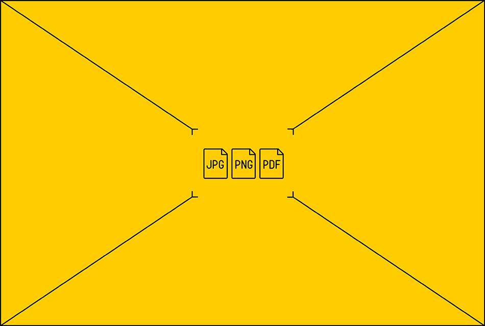

---

layout: default

---

# Яндекс

## **{{ site.presentation.title }}** {#cover}

    
{{ site.presentation.service }}





	
{{ site.author.name }},   {{ site.author.position }}

## Верхний колонтитул
{:.section}

### Название раздела

## Заголовок

### Вводный текст (первый уровень текста)

*  Второй уровень текста
	* Третий уровень текста (буллиты)

	1. Четвертый уровень текста

## Заголовок

### Вводный текст (первый уровень текста)
{:.right-image}

*  Второй уровень текста
	* Третий уровень текста (буллиты)
	* Третий уровень текста (буллиты)

	1. Четвертый уровень текста

## &nbsp;
{:.with-big-quote}
> Цитата

Текст
{:.note}

## Пример подсветки кода на JavaScript

~~~ javascript
!function() {
    var jar,
        rstoreNames = /[^\w]/g,
        storageInfo = window.storageInfo || window.webkitStorageInfo,
        toString = "".toString;

    jar = this.jar = function( name, storage ) {
        return new jar.fn.init( name, storage );
    };

    jar.storages = [];
    jar.instances = {};
    jar.prefixes = {
        storageInfo: storageInfo
    };

    jar.prototype = this.jar.fn = {
        constructor: jar,

        version: 0,

        storages: [],
        support: {},

        types: [ "xml", "html", "javascript", "js", "css", "text", "json" ],

        init: function( name, storage ) {

            // Name of a object store must contain only alphabetical symbols or low dash
            this.name = name ? name.replace( rstoreNames, "_" ) : "jar";
            this.deferreds = {};

            if ( !storage ) {
                this.order = jar.order;
            }

            // TODO – add support for aliases
            return this.setup( storage || this.storages );
        },

        // Setup for all storages
        setup: function( storages ) {
            this.storages = storages = storages.split ? storages.split(" ") : storages;

            var storage,
                self = this,
                def = this.register(),
                rejects = [],
                defs = [];

            this.stores = jar.instances[ this.name ] || {};

            // Jar store meta-info in lc, if we don't have it – reject call
            if ( !window.localStorage ) {
                window.setTimeout(function() {
                    def.reject();
                });
                return this;
            }

            // Initiate all storages that we can work with
            for ( var i = 0, l = storages.length; i < l; i++ ) {
                storage = storages[ i ];

                // This check needed if user explicitly specified storage that
                // he wants to work with, whereas browser don't implement it
                if ( jar.isUsed( storage ) ) {

                    // If jar with the same name was created, do not try to re-create store
                    if ( !this.stores[ storage ] ) {

                        // Initiate storage
                        defs.push( this[ storage ]( this.name, this ) );

                        // Initiate meta-data for this storage
                        this.log( storage );
                    }

                } else {
                    rejects.push( storage );
                }
            }

            if ( !this.order ) {
                this.order = {};

                for ( i = 0, l = this.types.length; i < l; i++ ) {
                    this.order[ this.types[ i ] ] = storages;
                }
            }

            if ( rejects.length == storages.length ) {
                window.setTimeout(function() {
                    def.reject();
                });

            } else {
                jar.when.apply( this, defs )
                    .done(function() {
                        jar.instances[ this.name ] = this.stores;

                        window.setTimeout(function() {
                            def.resolve([ self ]);
                        });
                    })
                    .fail(function() {
                        def.reject();
                    });
            }
            return this;
        }
    };

    jar.fn.init.prototype = jar.fn;

    jar.has = function( base, name ) {
        return !!jar.fn.meta( name, base.replace( rstoreNames, "_" ) );
    };
}.call( window );
~~~

## Пример подсветки кода
{:.code-with-text}

Вводный текст

~~~ javascript
var jar,
    rstoreNames = /[^\w]/g,
    storageInfo = window.storageInfo || window.webkitStorageInfo,
    toString = "".toString;

jar = this.jar = function( name, storage ) {
    return new jar.fn.init( name, storage );
};
~~~

## &nbsp;
{:.big-code}

~~~ javascript
!function() {
    var jar,
        rstoreNames = /[^\w]/g,
        storageInfo = window.storageInfo || window.webkitStorageInfo,
        toString = "".toString;

    jar = this.jar = function( name, storage ) {
        return new jar.fn.init( name, storage );
    };

    jar.storages = [];
    jar.instances = {};
    jar.prefixes = {
        storageInfo: storageInfo
    };
}.call( window );
~~~

## LaTeX

Библиотека для латекса довольно тяжелая, а нужна она в редких случаях.
Поэтому она не включена в репу, ее нужно либо установить через bower либо иметь интернет.

When $a \ne 0$, there are two solutions to \(ax^2 + bx + c = 0\) and they are
$$x = {-b \pm \sqrt{b^2-4ac} \over 2a}.$$

## Заголовок
{:.images}

*Текст*

*Текст*

*Текст*

## Заголовок
{:.images .two}

*Текст*

*Текст*

## Заголовок
{:.center}

{:.tmp}

## ****

## 
{:.cover}

## Таблица

|  Locavore      | Umami       | Helvetica | Vegan     |
+----------------|-------------|-----------|-----------+
| Fingerstache   | Kale        | Chips     | Keytar    |
| Sriracha       | Gluten-free | Ennui     | Keffiyeh  |
| Thundercats    | Jean        | Shorts    | Biodiesel |
| Terry          | Richardson  | Swag      | Blog      |
+----------------|-------------|-----------|-----------+

## Таблица с дополнительным полем

{:.with-additional-line}
|  Locavore      | Umami       | Helvetica | Vegan     |
+----------------|-------------|-----------|-----------+
| Fingerstache   | Kale        | Chips     | Keytar    |
| Sriracha       | Gluten-free | Ennui     | Keffiyeh  |
| Thundercats    | Jean        | Shorts    | Biodiesel |
| Terry          | Richardson  | Swag      | Blog      |
+----------------|-------------|-----------|-----------+
| Terry          | Richardson  | Swag      | Blog      |

## **Контакты** {#contacts}

{{ site.author.name }}

{{ site.author.position }}

    

        
+7 (000) 000-00-00

        
почта@yandex-team.ru

        
@twitter

        <!-- 
vk
 -->
        
facebook

    

